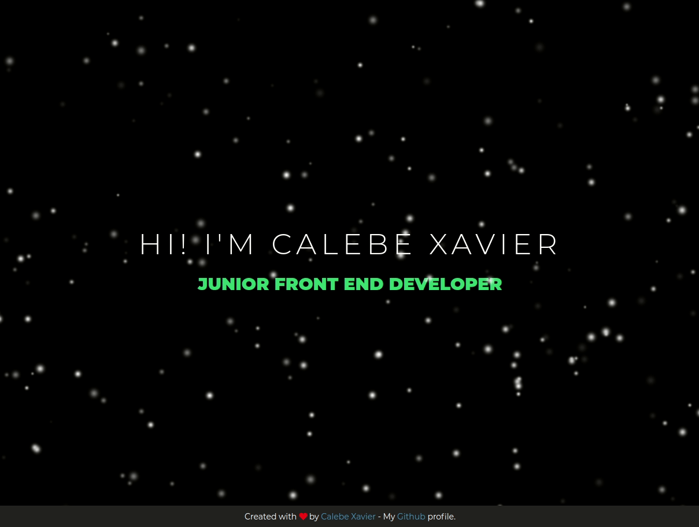

[EN](#id100) | [PT-BR](#id101)

##  30diasDeCSS 
 
 Olá Comunidade, beleza? 🖖 

 30 dias de CSS3, é um desafio que visa me ajudar a melhorar as habilidades de codificação fazendo mini projetos diarios utilizando HTML5 e CSS3 

 ## Objetivo

30 dias de CSS3 é um desafio que aceitei do perfil da @MilenaCarecho (e você também pode participar), onde estarei iniciando a partir de hoje (01 de Dezembro de 2020), que visa melhorar minhas habilidades em HTML5 e CSS3 através da realização de projetos. 

## Regras gerais

* Realizar um projeto por dia
* Compartilhe seu progresso nas mídias sociais (Twitter, Facebook, Linkedin etc.) usando a hashtag #30diasDeCSS
* O projeto deve ser concluído até 23:59

Gostou da ideia? 
[Clique aqui](https://github.com/MilenaCarecho/30diasDeCSS/issues/1) para participar 

#### Youtube Referencias e ideias para os desafios
[Online Tutorials](https://www.youtube.com/channel/UCbwXnUipZsLfUckBPsC7Jog) - 
[Creative Creations](https://www.youtube.com/channel/UCOKmVksbzoKJKmtu7rlEM1A) - 
[DarkCode](https://www.youtube.com/channel/UCD3KVjbb7aq2OiOffuungzw)

Abaixo estarei especificando cada projeto seguindo o modelo da @MilenaCarecho

* [Dia 01 - Efeito pulsar com imagens e design responsivo](#id01)
* [Dia 02 - Snake Border e design responsivo](#id02)
* [Dia 03 - Efeito Girar](#id03)
* [Dia 04 - Efeito Hover no Menu](#id04)
* [Dia 05 - Formulário para Login](#id05)
* [Dia 06 - Portfolio Landing Page Responsive](#id06)
* [Dia 07 - Responsive Contact Form](#id07)
* [Dia 08 - Loading Animation](#id08)
* [Dia 09 - Profile Card](#id09)
* [Dia 10 - Text Animation](#id10)
* [Dia 11 - Card Hover](#id11)
* [Dia 12 - Parallax Scrolling](#id12)
* [Dia 13 - Button Riplle Effect](#id13)
* [Dia 14 - Hovering Cards](#id14)
* [Dia 15 - Creative Hover Menu](#id15)
* [Dia 16 - Move Background On Scroll](#id16)
* [Dia 17 - Acoordin Menu](#id17)
* [Dia 18 - Social Tiles](#id18)
* [Dia 19 - Responsive Box](#id19)
* [Dia 20 - Hexagon Image Hover](#id20)
* [Dia 21 - Picture Hover Effect](#id21)
* [Dia 22 - Cards Animations](#id22)
* [Dia 23 - Simple Form Login](#id23)

##  Desafio dia 01 - Efeito pulsar com imagens e design responsivo 

[Meu código](https://github.com/Calebe-Xavier-Developer/30diasDeCSS/tree/main/Challenges/day01_PulseEffect)

[Post LinkedIn](https://www.linkedin.com/feed/update/urn:li:activity:6739651237563662336/) 

##  Desafio dia 02 - Snake Border e design responsivo 

[Meu código](https://github.com/Calebe-Xavier-Developer/30diasDeCSS/tree/main/Challenges/day02_SnakeBorder)

[Post LinkedIn](https://www.linkedin.com/feed/update/urn:li:activity:6740088385932681217/) 

##  Desafio dia 03 - Efeito Girar 

[Meu código](https://github.com/Calebe-Xavier-Developer/30diasDeCSS/tree/main/Challenges/day03_FlipEffect)

[Post LinkedIn](https://www.linkedin.com/feed/update/urn:li:activity:6740400467605508097/)

##  Desafio dia 04 - Efeito Hover no Menu 

[Meu código](https://github.com/Calebe-Xavier-Developer/30diasDeCSS/tree/main/Challenges/day04_HoverMenu)

[Post Linkedin](https://www.linkedin.com/feed/update/urn:li:activity:6740631457326231552/)

##  Desafio dia 05 - Formulário para Login 

[Meu código](https://github.com/Calebe-Xavier-Developer/30diasDeCSS/tree/main/Challenges/day05_LoginForm)

[Post Linkedin](https://www.linkedin.com/feed/update/urn:li:ugcPost:6741176081149132800/)

##  Desafio dia 06 - Portfolio Landing Page Responsive 

[Meu código](https://github.com/Calebe-Xavier-Developer/30diasDeCSS/tree/main/Challenges/day06_PortifolioLandingPage)

[Post Linkedin](https://www.linkedin.com/feed/update/urn:li:activity:6741544885771358208/)

##  Desafio dia 07 - Responsive Contact Form 

[Meu código](https://github.com/Calebe-Xavier-Developer/30diasDeCSS/tree/main/Challenges/day07_ResponsiveContactForm)

[Post Linkedin](https://www.linkedin.com/feed/update/urn:li:activity:6741901984623812608/)

##  Desafio dia 08 - Loading Animation 

[Meu código](https://github.com/Calebe-Xavier-Developer/30diasDeCSS/tree/main/Challenges/day08_LoadingAnimation)

[Post Linkedin](https://www.linkedin.com/feed/update/urn:li:ugcPost:6742256310970015744/)

##  Desafio dia 09 - Profile Card 

[Meu código](https://github.com/Calebe-Xavier-Developer/30diasDeCSS/tree/main/Challenges/day09_ProfileCard)

[Post Linkedin](https://www.linkedin.com/feed/update/urn:li:activity:6742627560343113728/)

##  Desafio dia 10 - Text Animation 

[Meu código](https://github.com/Calebe-Xavier-Developer/30diasDeCSS/tree/main/Challenges/day10_TextAnimation)

[Post Linkedin](https://www.linkedin.com/feed/update/urn:li:ugcPost:6742995138647232512/)

##  Desafio dia 11 - Card Hover 

[Meu código](https://github.com/Calebe-Xavier-Developer/30diasDeCSS/tree/main/Challenges/day11_CardHoverEffect)

[Post Linkedin](https://www.linkedin.com/feed/update/urn:li:ugcPost:6743349434240782336/)

##  Desafio dia 12 - Parallax Scrolling 

[Meu código](https://github.com/Calebe-Xavier-Developer/30diasDeCSS/tree/main/Challenges/day12_ParallaxScrolling)

[Post Linkedin](https://www.linkedin.com/feed/update/urn%3Ali%3Aactivity%3A6743710056086286336/)

##  Desafio dia 13 - Button Riplle Effect 

[Meu código](https://github.com/Calebe-Xavier-Developer/30diasDeCSS/tree/main/Challenges/day13_ButtonRiplleEffect)

[Post Linkedin](https://www.linkedin.com/feed/update/urn:li:activity:6744075169486139392/)

##  Desafio dia 14 - Hovering Cards 

[Meu código](https://github.com/Calebe-Xavier-Developer/30diasDeCSS/tree/main/Challenges/day14_HoveringCards)

[Post Linkedin](https://www.linkedin.com/feed/update/urn:li:activity:6744439881885356032/)

##  Desafio dia 15 - Creative Hover Menu 

[Meu código](https://github.com/Calebe-Xavier-Developer/30diasDeCSS/tree/main/Challenges/day15_CreativeHoverMenu)

[Post Linkedin](https://www.linkedin.com/posts/calebe-xavier_30diasdecss-activity-6745160272735936512-By3A)

##  Desafio dia 16 - Move Background On Scroll 

[Meu código](https://github.com/Calebe-Xavier-Developer/30diasDeCSS/tree/main/Challenges/day16_MoveBackgroundOnScroll)

[Post Linkedin](https://www.linkedin.com/posts/calebe-xavier_30diasdecss-activity-6745505034022223872-iU3K)

##  Desafio dia 17 - Acoordin Menu 

[Meu código](https://github.com/Calebe-Xavier-Developer/30diasDeCSS/tree/main/Challenges/day17_AcorddingMenu)

[Post Linkedin](https://www.linkedin.com/posts/calebe-xavier_30diasdecss-activity-6745888819989487617-y5q4)

##  Desafio dia 18 - Social Tiles 

[Meu código](https://github.com/Calebe-Xavier-Developer/30diasDeCSS/tree/main/Challenges/day18_SocialTiles)

[Post Linkedin](https://www.linkedin.com/posts/calebe-xavier_30diasdecss-activity-6749174143444385792-Wi1j)

##  Desafio dia 19 - Responsive Box 

[Meu código](https://github.com/Calebe-Xavier-Developer/30diasDeCSS/tree/main/Challenges/day19_ResponsiveBox)

[Post Linkedin](https://www.linkedin.com/posts/calebe-xavier_30diasdecss-activity-6749174494742515712-1WBw)

##  Desafio dia 20 - Hexagon Image Hover 

[Meu código](https://github.com/Calebe-Xavier-Developer/30diasDeCSS/tree/main/Challenges/day20_HexagonImageHover)

[Post Linkedin](https://www.linkedin.com/posts/calebe-xavier_30diasdecss-activity-6750150824485232640-4swT)

##  Desafio dia 21 - Picture Hover Effect 

[Meu código](https://github.com/Calebe-Xavier-Developer/30diasDeCSS/tree/main/Challenges/day21_PictureHoverEffect)

[Post Linkedin](https://www.linkedin.com/posts/calebe-xavier_30diasdecss-activity-6750150994602024960-pAWS)

##  Desafio dia 22 - Cards Animations 

[Meu código](https://github.com/Calebe-Xavier-Developer/30diasDeCSS/tree/main/Challenges/day22_UIAnimations)

[Post Linkedin](https://www.linkedin.com/posts/calebe-xavier_30diasdecss-activity-6750151611600904192-2Yks)

##  Desafio dia 23 - Simple Form Login 

[Meu código](https://github.com/Calebe-Xavier-Developer/30diasDeCSS/tree/main/Challenges/day23_SimpleFormLogin)

[Post Linkedin](https://www.linkedin.com/posts/calebe-xavier_30diasdecss-activity-6750511099684130816-TmUz)

##  Desafio dia 24 - Glass Morphism Effect 

[Meu código](https://github.com/Calebe-Xavier-Developer/30diasDeCSS/tree/main/Challenges/day24_GlassMorphismEffect)

[Post Linkedin](https://www.linkedin.com/posts/calebe-xavier_30diasdecss-activity-6750511307843235840-esR4)

##  30diasDeCSS  
 
 Hello Community, that's ok? 🖖 

 30 days of CSS, is a challenge that aims to help me improve coding skills by doing mini daily projects using HTML5 and CSS3

 ## Goal

30 days of CSS3 is a challenge that I accepted from @MilenaCarecho profile (and you can also participate), where I will be starting from today (December 1st, 2020), which aims to improve my skills in HTML5 and CSS3 through the realization of projects.

## General rules

* Perform one project per day
* Share your progress on social media (Twitter, Facebook, Linkedin etc.) using the hashtag # 30diasDeCSS
* The project must be completed by 11:59 pm

Like the idea?
[Click here] (https://github.com/MilenaCarecho/30diasDeCSS/issues/1) to participate

#### Youtube References and ideas for the challenges
[Online Tutorials](https://www.youtube.com/channel/UCbwXnUipZsLfUckBPsC7Jog) -
[Creative Creations](https://www.youtube.com/channel/UCOKmVksbzoKJKmtu7rlEM1A) -
[DarkCode](https://www.youtube.com/channel/UCD3KVjbb7aq2OiOffuungzw)

Abaixo estarei especificando cada projeto seguindo o modelo da @MilenaCarecho

* [Day 01 - Pulse effect with images and responsive design](#id01000)
* [Dia 02 - Snake Border and responsive design](#id02000)
* [Dia 03 - Flip effect](#id03000)
* [Dia 04 - Hover effect in the menu](#id04000)
* [Dia 05 - Login form](#id05000)
* [Dia 06 - Responsive Portfolio](#id06000)
* [Dia 07 - Responsive Contact Form](#id07000)
* [Dia 08 - Loading Animation](#id08000)
* [Dia 09 - Profile Card](#id09000)
* [Dia 10 - Text Animation](#id10000)
* [Dia 11 - Card Hover](#id11000)
* [Dia 12 - Parallax Scrolling](#id12000)
* [Dia 13 - Button Riplle Effect](#id13000)
* [Dia 14 - Hovering Cards](#id14000)
* [Dia 15 - Creative Hover Menu](#id15000)
* [Dia 16 - Move Background On Scroll](#id16000)
* [Dia 17 - Agreement Menu](#id17000)
* [Dia 18 - Social Tiles](#id18000)
* [Dia 19 - Responsive Box](#id19000)
* [Dia 20 - Hexagon Image Hover](#id20000)
* [Dia 21 - Picture Hover Effect](#id21000)
* [Dia 22 - Cards Animations](#id22000)
* [Dia 23 - Simple Form Login](#id23000)
